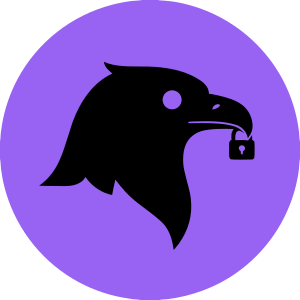

<div align="center">



# Raven

**Aplicativo Android — versão Flutter (temporária)**

[](https://flutter.dev)
[](https://dart.dev)
[](https://firebase.google.com)
[](https://github.com/Atirf007/raven_flutter)

</div>

---

> [!WARNING]
> **Esta não é a versão final do aplicativo.**
> O Raven está atualmente em desenvolvimento ativo. Funcionalidades podem mudar, quebrar ou ser removidas sem aviso prévio.

> [!NOTE]
> **Flutter é uma solução temporária.**
> Esta implementação em Flutter serve como base de desenvolvimento e prototipagem. O plano de longo prazo é portar o aplicativo para **Kotlin nativo**, visando melhor performance, acesso direto às APIs do Android e maior controle sobre o ciclo de vida da aplicação.

> [!NOTE]
> **Autenticação Firebase prevista para versões futuras.**
> O sistema de login/cadastro via Firebase Auth ainda não foi implementado e está planejado para uma próxima versão do aplicativo.

---

## Sobre o projeto

O Raven é um aplicativo Android que integra renderização de conteúdo web e navegação para links externos, com identidade visual própria.

---

## Funcionalidades

| Feature | Status |
|---|---|
| 🌐 Renderização de conteúdo web (WebView) | ✅ Disponível |
| 🔗 Abertura de links externos | ✅ Disponível |
| 🎨 Identidade visual / ícone personalizado | ✅ Disponível |
| 🔐 Autenticação com Firebase Auth | 🔜 Previsto para versões futuras |
| ☁️ Integração Firebase Core | 🔜 Previsto para versões futuras |

---

## Tecnologias

```
flutter_application_mobiletelas
├── flutter              ^3.11.4
├── firebase_core        ^4.10.0
├── firebase_auth        ^6.5.2
├── webview_flutter      ^4.13.1
├── url_launcher         ^6.3.0
└── cupertino_icons      ^1.0.8
```

---

## Estrutura do projeto

```
raven_flutter/
├── lib/                  # Código-fonte Dart
├── assets/
│   └── images/           # Logo, ícones e fotos da equipe
├── android/              # Configurações Android
├── test/                 # Testes automatizados
├── apk/                  # APK de distribuição
├── pubspec.yaml          # Dependências
└── firebase.json         # Configurações Firebase
```

---

## Instalação

### Pré-requisitos

- [Flutter](https://flutter.dev/docs/get-started/install) `>= 3.11.4`
- [Android Studio](https://developer.android.com/studio) ou [VS Code](https://code.visualstudio.com/)
- Projeto criado no [Firebase Console](https://console.firebase.google.com/)

### Passos

```bash
# 1. Clone o repositório
git clone https://github.com/Atirf007/raven_flutter.git
cd raven_flutter

# 2. Instale as dependências
flutter pub get

# 3. Execute o app
flutter run
```

### Configuração do Firebase

> [!NOTE]
> A autenticação Firebase ainda não foi implementada e está prevista para versões futuras.

Adicione os arquivos de configuração:

```
android/app/google-services.json       ← Android
```

---

## Build para produção

```bash
# Android APK
flutter build apk --release

# Android App Bundle
flutter build appbundle --release
```

---

## Testes

```bash
flutter test
```

---

## Equipe

<div align="center">

|  |  |  |  |
|:---:|:---:|:---:|:---:|
| **Pedro** | **Gustavo** | **Ciro** | **Gabriel** |

</div>

---

## Roadmap

- [x] Estrutura base do app em Flutter
- [x] Integração WebView e url_launcher
- [x] Ícone personalizado e identidade visual
- [ ] Implementação da autenticação Firebase Auth
- [ ] Testes de integração
- [ ] **Port para Kotlin nativo** *(meta principal)*

---

## Links

- [Documentação Flutter](https://docs.flutter.dev/)
- [Firebase para Flutter](https://firebase.google.com/docs/flutter/setup)
- [Kotlin para Android](https://developer.android.com/kotlin)

---

<div align="center">
<sub>Raven · Versão Flutter temporária · Não é a versão final</sub>
</div>